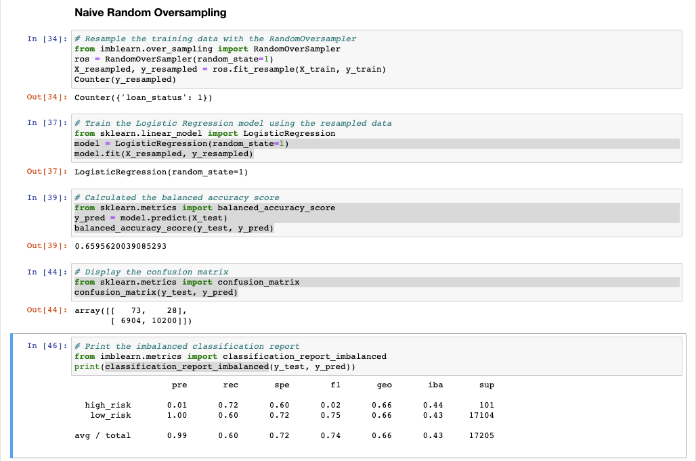
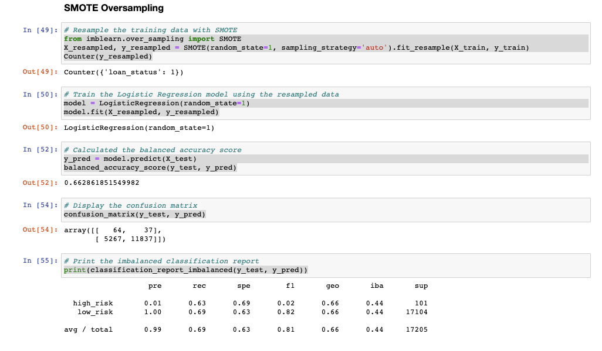
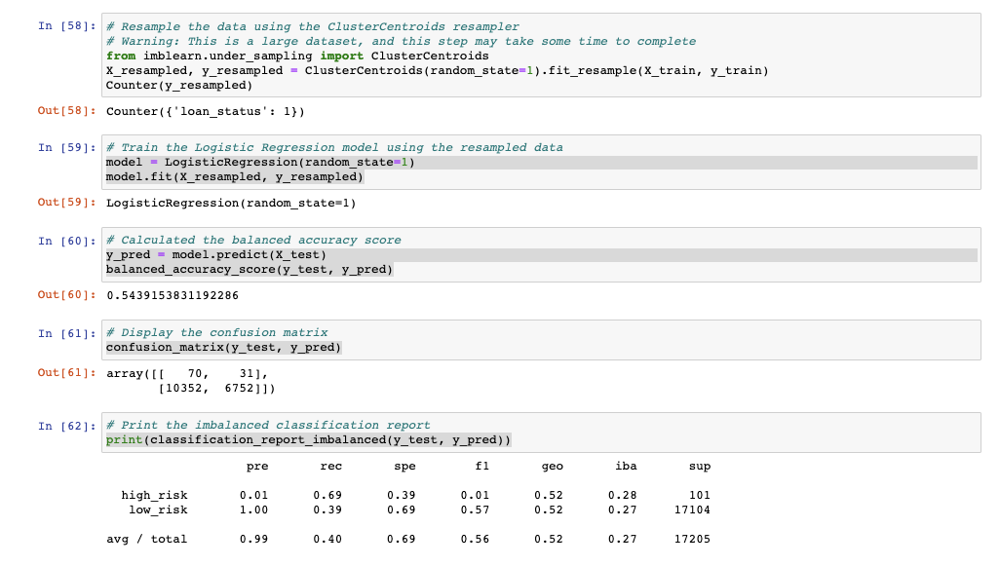
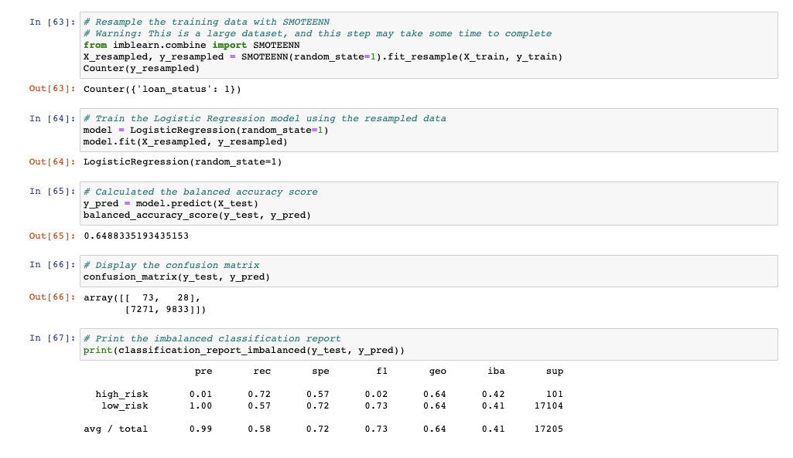
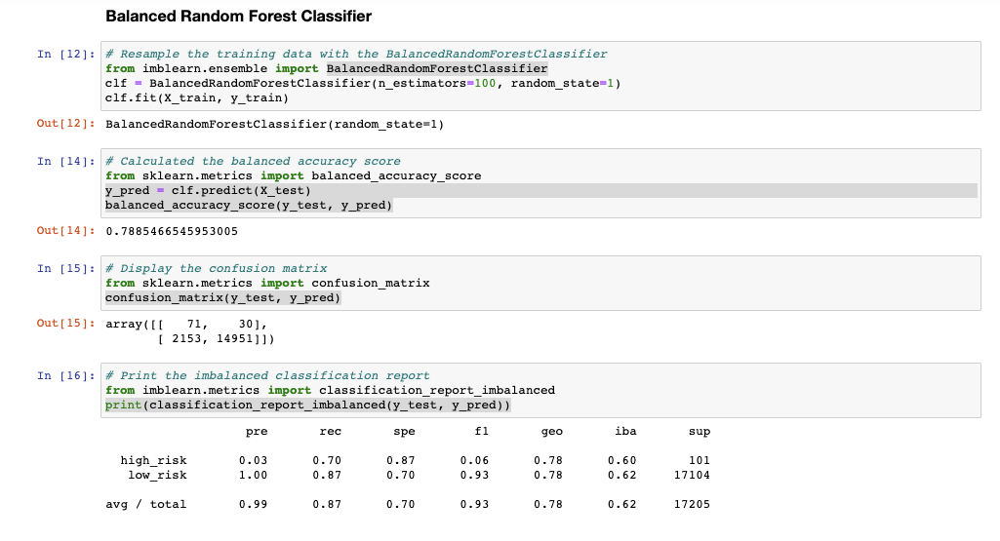
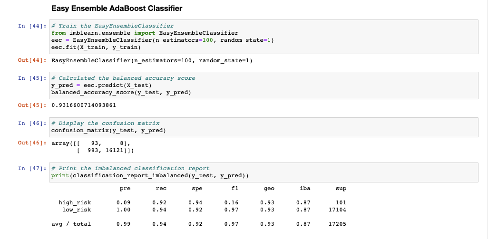

# Credit_Risk_Analysis

## Overview
The goal is to use imbalanced-learn and scikit-learn to evaluate different sampling techniques and models to predict credit risk.
I will be comparing LogisticRegression performance using RandomOverSampler, SMOTE, ClusterCentroids, and SMOTEENN sampling algorithms.
I will also be comparing performance of the BlancedRandomForestClassifer and EasyEnsembleClassifer machine learning models.

## Results
- Oversampling
  - RandomOverSampler + LogisticRegression
    - blanced accuracy score: 0.65956
    - precision: 0.99
    - recall: 0.60
    
  - SMOTE + LogisticRegression
    - blanced accuracy score: 0.66286
    - precision: 0.99
    - recall: 0.69
    
- Undersampling
  - ClusterCentroids + LogisticRegression
    - blanced accuracy score: 0.54392
    - precision: 0.99
    - recall: 0.40
    
- Combination
  - SMOTEENN + LogisticRegression
    - blanced accuracy score: 0.64883
    - precision: 0.99
    - recall: 0.58
    
- Ensemble Learners
  - BlancedRandomForestClassifier
    - blanced accuracy score: 0.78855
    - precision: 0.99
    - recall: 0.87
    
  - EasyEnsembleClassifier
    - blanced accuracy score: 0.93166
    - precision: 0.99
    - recall: 0.94
    

## Summary
For this dataset, oversampling techniques had higher accuracy scores and recall than undersampling or a combination. SMOTE performed slightly better than RandomOverSampler.

Overall, I would recommend using the EasyEnsembleClassier modal which performed the best by far with a blended accuracy score of 0.93 and a recall of 0.94. 
    

